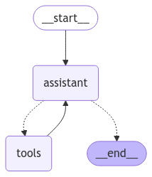

# Simple Agent Implementation

To help LLMs answer the questions around counting various characters in strings correctly, we create a simple agent that has access to some basic data processing tools. 

We compare the response of an LLM and the agents. 





```python
output = llm.invoke("How many r's in raspberry?")
output.pretty_print()

# ================================== Ai Message ==================================

# There are two "r's" in the word "raspberry."
```

```python
output = graph.invoke({"messages": [HumanMessage(content="How many r's in raspberry?")]})
for m in output['messages']:
    m.pretty_print()

# ================================ Human Message =================================

# How many r's in raspberry?
# ================================== Ai Message ==================================
# Tool Calls:
#   construct_frequency_map (call_ReLnVpJOp6YASyK07f1bfq0h)
# Call ID: call_ReLnVpJOp6YASyK07f1bfq0h
#  Args:
#    string: raspberry
# ================================= Tool Message =================================
# Name: construct_frequency_map

# {"r": 3, "a": 1, "s": 1, "p": 1, "b": 1, "e": 1, "y": 1}
# ================================== Ai Message ==================================

# There are 3 'r's in the word "raspberry."
```