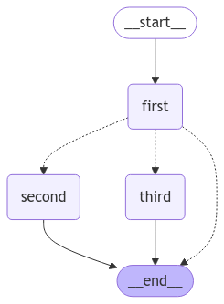
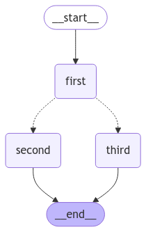

# Importance of Return Types

If the funtion is defined without a proper return type, such as below.

```python
def mood(state):
    if random.random() < 0.5:
        return "second"
    return "third"
```

It results in the following graph



Adding the return type fixes it.

```python
def mood(state) -> Literal["second", "third"]:
    if random.random() < 0.5:
        return "second"
    return "third"
```

